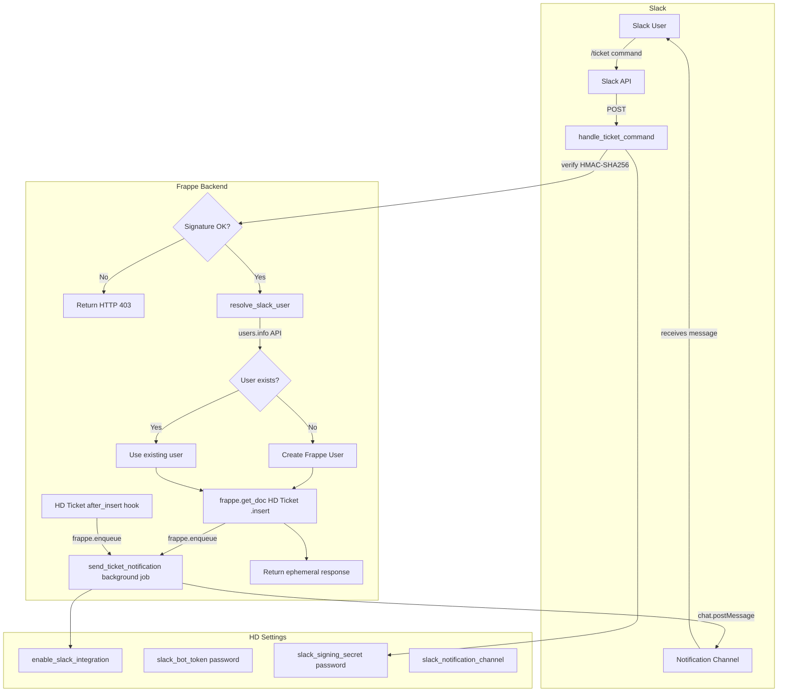

# Design Document: Slack Integration

## Overview

This document describes the technical design for adding Slack integration to Frappe Helpdesk. The feature has two main capabilities:

1. **Outbound Notifications** — When a new HD Ticket is created and Slack integration is enabled, a background job posts a Block Kit message to the configured Slack channel.
2. **Slash Command Ticket Creation** — A `/ticket <description>` slash command hits a Frappe API endpoint, verifies the request signature, resolves the Slack user to a Frappe user, creates an HD Ticket, and returns an ephemeral confirmation.

Configuration lives in HD Settings (a singleton DocType), managed through a new "Slack" tab in the existing settings modal.

---

## Architecture



### Key Design Decisions

- **Credentials in HD Settings, not `frappe.conf`**: The existing `slack.py` skeleton reads from `frappe.conf`, but requirements specify HD Settings as the config store. This keeps credentials manageable via the UI and consistent with how other integrations (email, telephony) work in this codebase.
- **Background job for outbound notifications**: `frappe.enqueue` is used so ticket creation is never blocked by a slow or failing Slack API call.
- **Synchronous slash command handler**: The Slack 3-second timeout requires the ticket insert to happen synchronously in the request. Only the channel notification is deferred to a background job.
- **`allow_guest=True` on the slash command endpoint**: Slack sends requests without a Frappe session. Signature verification replaces session-based auth.
- **Password field type for secrets**: Frappe's `Password` field type encrypts values at rest and omits them from API responses, satisfying Requirement 1.5.

---

## Components and Interfaces

### Backend: `helpdesk/api/slack.py`

Replaces the existing skeleton. Contains three public-facing functions and several private helpers.

```
handle_ticket_command()          — @frappe.whitelist(allow_guest=True)
                                   Entry point for /ticket slash command

send_ticket_notification(ticket_name)
                                 — called via frappe.enqueue from after_insert hook
                                   and from handle_ticket_command

verify_slack_request(timestamp, signature, raw_body) -> bool
                                 — HMAC-SHA256 verification, constant-time compare

resolve_slack_user(slack_user_id) -> str | None
                                 — calls users.info, finds/creates Frappe User,
                                   returns email or None on failure

_get_slack_settings() -> dict    — reads HD Settings fields once, raises if not configured
_build_ticket_blocks(ticket) -> list
                                 — constructs Slack Block Kit payload
_ephemeral(text, blocks=None) -> dict
                                 — helper to build ephemeral response dict
```

### Backend: HD Settings DocType changes

New fields added to `hd_settings.json` under a new "Integrations" tab:

| fieldname | fieldtype | label |
|---|---|---|
| `integrations_tab` | Tab Break | Integrations |
| `slack_section` | Section Break | Slack Integration |
| `enable_slack_integration` | Check | Enable Slack Integration |
| `column_break_slack` | Column Break | — |
| `slack_bot_token` | Password | Slack Bot Token |
| `slack_signing_secret` | Password | Slack Signing Secret |
| `slack_notification_channel` | Data | Slack Notification Channel |

Validation in `hd_settings.py`: when `enable_slack_integration` is checked, both `slack_bot_token` and `slack_signing_secret` must be non-empty (mirrors the existing `validate_auto_close_days` pattern).

### Backend: `helpdesk/hooks.py` changes

Add a `doc_events` entry to trigger the notification on ticket insert:

```python
doc_events = {
    # ... existing entries ...
    "HD Ticket": {
        "after_insert": "helpdesk.api.slack.enqueue_ticket_notification",
    },
}
```

`enqueue_ticket_notification` is a thin wrapper that checks `enable_slack_integration` before calling `frappe.enqueue`.

### Frontend: `desk/src/components/Settings/Slack/SlackSettings.vue`

New Vue component following the same pattern as `TwilioSettings.vue` and `General.vue`:

- Uses `createDocumentResource` on `HD Settings`
- Renders a toggle (Switch), two password inputs, and a channel text input
- Disables/greys the three credential fields when the toggle is off
- Shows an "Unsaved" badge and Save button when dirty (same pattern as `General.vue`)
- Read-only for non-manager roles (checks `auth.isAdmin || auth.isManager`)

### Frontend: `desk/src/components/Settings/settingsModal.ts` changes

Add a new item to the "Integrations" tab group:

```typescript
{
  label: __("Slack"),
  icon: markRaw(LucideSlack),   // ~icons/lucide/slack
  component: markRaw(SlackSettings),
  condition: () => auth.isAdmin || auth.isManager,
}
```

---

## Data Models

### HD Settings — new fields (additions to existing singleton)

```
enable_slack_integration   : Check (default 0)
slack_bot_token            : Password
slack_signing_secret       : Password
slack_notification_channel : Data  (e.g. "#devops-tickets")
```

No new DocTypes are introduced. All Slack config is stored in the existing HD Settings singleton.

### Slack Block Kit message shape (outbound notification)

```json
{
  "channel": "<slack_notification_channel>",
  "blocks": [
    {
      "type": "section",
      "fields": [
        { "type": "mrkdwn", "text": "*Ticket:*\n<ticket_name>" },
        { "type": "mrkdwn", "text": "*Priority:*\n<priority>" },
        { "type": "mrkdwn", "text": "*Subject:*\n<subject>" },
        { "type": "mrkdwn", "text": "*Raised by:*\n<raised_by>" },
        { "type": "mrkdwn", "text": "*Type:*\n<ticket_type>" }
      ]
    },
    {
      "type": "actions",
      "elements": [
        {
          "type": "button",
          "text": { "type": "plain_text", "text": "Open in Helpdesk" },
          "url": "<frappe.utils.get_url()>/helpdesk/tickets/<ticket_name>"
        }
      ]
    }
  ]
}
```

### Slash command ephemeral success response shape

```json
{
  "response_type": "ephemeral",
  "blocks": [
    {
      "type": "section",
      "text": {
        "type": "mrkdwn",
        "text": "✅ Ticket *<ticket_name>* created\n<subject_preview (max 100 chars)>"
      }
    },
    {
      "type": "actions",
      "elements": [
        {
          "type": "button",
          "text": { "type": "plain_text", "text": "Open in Helpdesk" },
          "url": "<frappe.utils.get_url()>/helpdesk/tickets/<ticket_name>"
        }
      ]
    }
  ]
}
```

### Slash command ephemeral error response shape

```json
{
  "response_type": "ephemeral",
  "text": "<human-readable error message>"
}
```

---


## Correctness Properties

*A property is a characteristic or behavior that should hold true across all valid executions of a system — essentially, a formal statement about what the system should do. Properties serve as the bridge between human-readable specifications and machine-verifiable correctness guarantees.*

### Property 1: Disabled integration suppresses all notifications

*For any* HD Ticket inserted while `enable_slack_integration` is `False` in HD Settings, the Notification_Service shall make zero outbound HTTP calls to the Slack API.

**Validates: Requirements 1.2, 2.5**

---

### Property 2: Enabled integration with missing credentials fails validation

*For any* HD Settings document where `enable_slack_integration` is `True` and either `slack_bot_token` or `slack_signing_secret` is empty, calling `validate()` shall raise a `frappe.ValidationError` and prevent the document from being saved.

**Validates: Requirements 1.3, 1.4**

---

### Property 3: Notification message contains all required ticket fields

*For any* HD Ticket (with arbitrary name, subject, raised_by, priority, and ticket_type), calling `_build_ticket_blocks(ticket)` shall return a list that contains a `section` block whose fields include the ticket name, subject, raised_by, priority, ticket type, and a URL containing the ticket name; and an `actions` block containing a button element.

**Validates: Requirements 2.2, 2.6**

---

### Property 4: Notification failure does not propagate exceptions

*For any* HD Ticket, if the outbound HTTP call inside `send_ticket_notification` raises any exception, the function shall call `frappe.log_error` exactly once and shall not re-raise the exception.

**Validates: Requirements 2.4**

---

### Property 5: Signature verification accepts valid requests and rejects invalid ones

*For any* raw request body and signing secret, a request signed with the correct secret and a fresh timestamp (within 300 seconds) shall pass `verify_slack_request`; and *for any* request with a tampered body, wrong secret, or timestamp older than 300 seconds, `verify_slack_request` shall return `False`.

**Validates: Requirements 3.1, 3.2, 3.3, 3.5**

---

### Property 6: Valid slash command creates a ticket with correct fields

*For any* non-empty command text, Slack user ID, and channel name, when `handle_ticket_command` is called with a valid signature and `users.info` returns a valid email, the function shall create exactly one HD Ticket whose `subject` equals the command text (up to 200 chars), `raised_by` equals the resolved email, `priority` equals `"Medium"`, and `description` contains the command text, the Slack username, and the channel name.

**Validates: Requirements 4.1, 4.2, 4.3, 4.4, 5.1**

---

### Property 7: Invalid inputs prevent ticket creation

*For any* call to `handle_ticket_command` where the command text is empty or whitespace-only, or where `users.info` returns `ok: false` or no email, the function shall return an ephemeral response and shall create zero HD Tickets.

**Validates: Requirements 4.6, 4.7, 5.5**

---

### Property 8: Ticket creation failure returns ephemeral error and logs

*For any* call to `handle_ticket_command` where the HD Ticket insert raises a Frappe exception, the function shall call `frappe.log_error` and return an ephemeral response whose `text` does not contain a Python traceback string.

**Validates: Requirements 4.8, 6.4**

---

### Property 9: User resolution creates new user only when none exists

*For any* Slack user ID and email returned by `users.info`, if a Frappe User with that email already exists then `resolve_slack_user` shall return that email without inserting a new User document; if no such User exists, `resolve_slack_user` shall insert exactly one new User document and return its email.

**Validates: Requirements 5.2, 5.3**

---

### Property 10: All slash command responses use ephemeral response type

*For any* input to `handle_ticket_command` (valid, invalid, or error), the returned dict shall contain `"response_type": "ephemeral"`.

**Validates: Requirements 6.1**

---

### Property 11: Settings UI disables credential fields when toggle is off

*For any* rendered `SlackSettings` component where `enable_slack_integration` is `false`, the Bot Token input, Signing Secret input, and Notification Channel input shall each have the `disabled` attribute set to `true`.

**Validates: Requirements 7.3**

---

### Property 12: Settings UI is read-only for non-manager users

*For any* authenticated user who does not have the Agent Manager or System Manager role, all input fields in the `SlackSettings` component shall be rendered as read-only.

**Validates: Requirements 7.5**

---

## Error Handling

### Outbound Slack API failures (Notification_Service)

- All HTTP calls are wrapped in `try/except Exception`.
- On failure: `frappe.log_error(title="Slack Notification Failed", message=...)` is called.
- No exception is re-raised — ticket creation is never rolled back due to a Slack failure.
- If `enable_slack_integration` is `False`, the function returns immediately without logging.

### Slash command request validation failures

- Stale timestamp (>300 s): return `frappe.throw` with `frappe.PermissionError` — Frappe translates this to HTTP 403.
- Signature mismatch: same as above.
- Missing signing secret in HD Settings: same as above.
- All 403 paths log nothing (they are expected rejection cases, not errors).

### User resolution failures

- `requests.get` timeout or network error: caught, `frappe.log_error` called, function returns `None`.
- Slack API returns `ok: false`: function returns `None`.
- `None` return causes `handle_ticket_command` to return an ephemeral error response immediately without creating a ticket.

### HD Settings validation failures

- Missing bot token or signing secret when integration is enabled: `frappe.throw(_("..."))` in `HDSettings.validate()` — standard Frappe validation error shown in the UI.

### Frontend error handling

- `createDocumentResource` error state is checked; a `toast.error(...)` is shown on save failure.
- The Save button is disabled while the resource is loading to prevent double-submit.

---

## Testing Strategy

### Dual Testing Approach

Both unit tests and property-based tests are required. They are complementary:

- **Unit tests** cover specific examples, integration points, and edge cases.
- **Property-based tests** verify universal correctness across randomly generated inputs.

### Property-Based Testing

**Library**: [`hypothesis`](https://hypothesis.readthedocs.io/) (Python) — the standard PBT library for Python projects.

Each property-based test must run a minimum of **100 iterations** (Hypothesis default is 100; set `@settings(max_examples=100)` explicitly).

Each test must include a comment referencing the design property it validates:

```python
# Feature: slack-integration, Property 5: Signature verification accepts valid requests and rejects invalid ones
@given(body=st.binary(), secret=st.text(min_size=1), age=st.integers(min_value=301))
@settings(max_examples=100)
def test_stale_timestamp_rejected(body, secret, age):
    ...
```

**Property tests to implement** (one test per property):

| Property | Test description |
|---|---|
| P1 | For random tickets, assert no HTTP call when toggle is off |
| P2 | For random settings with toggle on and empty token/secret, assert ValidationError |
| P3 | For random ticket dicts, assert block output contains all required fields |
| P4 | For random tickets, mock HTTP to raise, assert log_error called and no exception |
| P5 | For random bodies/secrets/timestamps, assert verify_slack_request correctness |
| P6 | For random command texts/users/channels, assert ticket fields match inputs |
| P7 | For empty/whitespace texts and failed user.info responses, assert no ticket created |
| P8 | For random inputs where insert raises, assert log_error called and no traceback in response |
| P9 | For random emails, assert user creation only when user does not exist |
| P10 | For any input, assert response_type == "ephemeral" |
| P11 | Frontend: for toggle=false state, assert all three fields have disabled=true |
| P12 | Frontend: for non-manager user, assert all fields are read-only |

### Unit Tests

Unit tests focus on:

- **Schema check**: HD Settings JSON contains the four new Slack fields with correct `fieldtype` values (example for Req 1.1, 1.5).
- **Background job dispatch**: assert `frappe.enqueue` is called (not a direct HTTP call) in the `after_insert` path (example for Req 2.3).
- **Constant-time comparison**: assert `hmac.compare_digest` is used in `verify_slack_request` source (example for Req 3.4).
- **5-second timeout**: assert `timeout=5` is passed in all `requests.get/post` calls (example for Req 5.4).
- **Settings UI renders**: component mounts without errors and contains the Slack Integration section heading (example for Req 7.1, 7.2).
- **Save feedback**: after a successful save, a toast confirmation is shown (example for Req 7.4).

### Test File Locations

- Backend: `helpdesk/tests/test_slack.py`
- Frontend: `desk/src/components/Settings/Slack/__tests__/SlackSettings.spec.ts`
